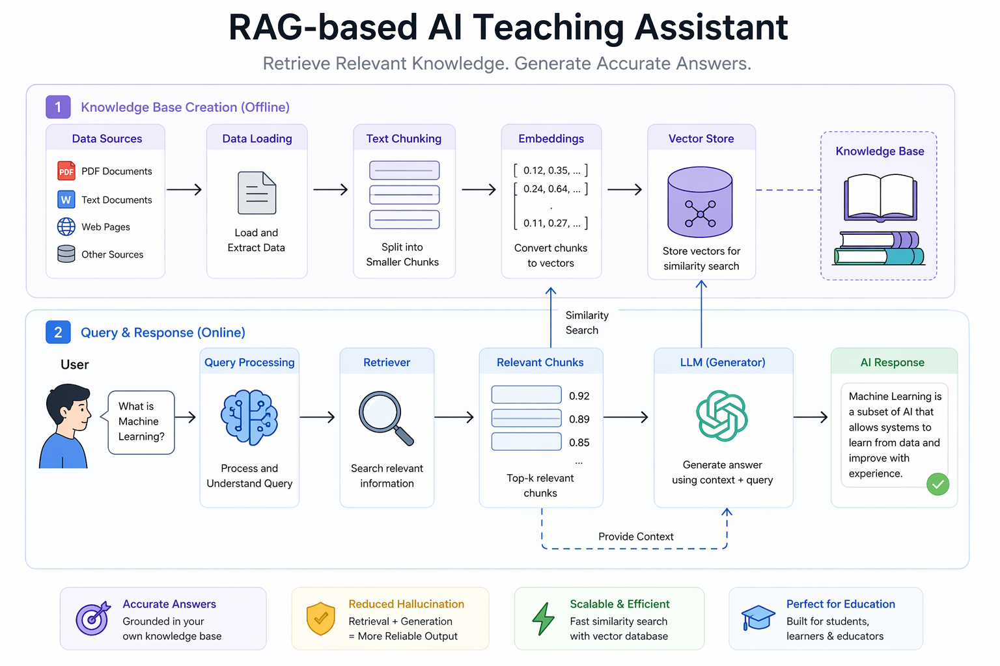

RAG-based AI Teaching Assistant

Overview

This project is a Retrieval-Augmented Generation (RAG) based AI Teaching Assistant that answers user queries using a custom knowledge base.

Instead of relying only on a language model, the system retrieves relevant information and generates context-aware, accurate responses.

How It Works

1. User inputs a question
2. System processes and analyzes the query
3. Relevant information is retrieved from stored data
4. Context is passed to the model
5. AI generates a meaningful response
⚙️ Features

📚 Custom knowledge-based question answering
🔍 Retrieval-based response generation
🤖 Basic integration of AI/LLM concepts
🧹 Data preprocessing and text handling
⚡ Fast and simple query processing

🛠️ Tech Stack
* Python
* Jupyter Notebook
* NumPy / Pandas
* NLP Concepts
* Machine Learning Basics

